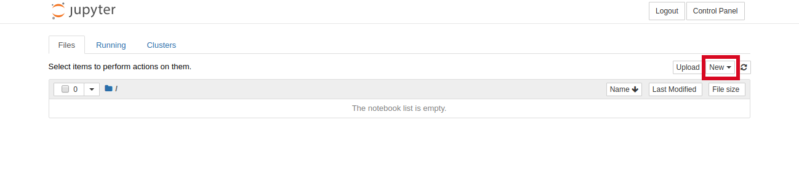
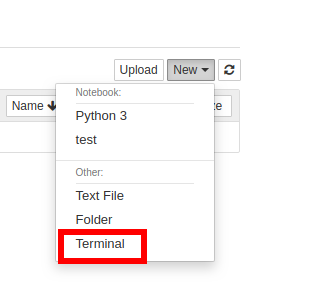
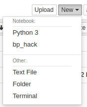

# 2020 Computational Psychiatry Hackathon

## Interactive Data Analysis Service (IDAS)

University of Iowa's Interactive Data Analysis Service (IDAS) is a great way
to access an interactive environment for writing analysis code while
harnessing the awesome computational power of Argon.
[The page describing IDAS](https://hpc.uiowa.edu/compute/interactive-data-analytics-service-idas)
has a link to request an account, which is required to follow this guide.

## Requesting Resources

Once you have an account visit this url: https://notebooks.hpc.uiowa.edu/research-interactive

That will take you to a page to request resources for your computational environment.

TODO:

- recommendations for resources
- mounting the hackathon data
- selecting python

## Software Setup

When the jupyter notebook interface is open, you are ready to install
some packages to help you get productive quickly.

1. First click new on the right hand side of the jupyter notebook interface.
    - 
2. Then click terminal so we can enter some commands.
    - 
3. Type the following to get the code we are going to run.
    - `git clone https://github.com/jdkent/2020-comp_psych_hackathon.git`
4. Change directories into `2020-comp_psych_hackathon`.
    - `cd 2020-comp_psych_hackathon`
5. run `setup.sh`. You should see a bunch of text on the screen as the
software is downloaded.
    - `./setup.sh`
6. Click on the jupyter logo after `setup.sh` is done.

7. Click on `new` again and select `bp_hack`
    - 

## Start Hacking!

From here you can start writing python code and building models!
You can checkout [nilearn](https://nilearn.github.io/)
and [scikit-learn](https://scikit-learn.org/stable/) for inspiration.
(Perhaps further tutorials incoming).
